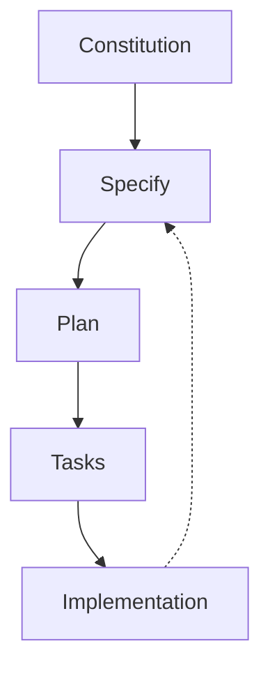
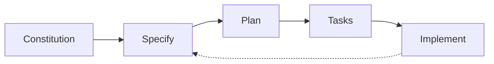

# Spec-Driven Development
从 Vibe Coding 到规范驱动开发的演进

<div class="pt-12">
  <span class="px-2 py-1 rounded cursor-pointer" hover="bg-white bg-opacity-10">
   
  </span>
</div>

<div class="abs-br m-6 flex gap-2">
  <a href="https://github.com/github/spec-kit" target="_blank"
    class="text-sm opacity-50 !border-none !hover:text-white">
    github/spec-kit
  </a>
</div>
<!--
🔸 这是我的讲稿备注
🔸 我要讲的重点：介绍 Slidev
🔸 提醒：强调“代码高亮”和“远程控制”
 - 备注写在“每一页的结尾” 分割线 --- 前面 
 http://localhost:3030/presenter/2 演讲者用的
 http://localhost:3030/2?clicks=0 观众用的
-->

---
layout: two-cols
layoutClass: gap-16
---

# AI 编程的现状

2025 年，AI 编程已成为主流


### 惊人的数据

- Y Combinator 2025 冬季批次中
- **25%** 的项目代码库
- **95%** 由 AI 生成

<div class="text-xs text-gray-500 mt-1">— Garry Tan (YC CEO), 2025</div>

### Vibe Coding 时代

> "Vibe Coding" 一词由 Andrej Karpathy 于 2025 年 2 月提出

<div class="text-xs text-gray-500">— 前 Tesla AI 总监、OpenAI 联合创始人</div>

::right::

<div class="mt-12">

### 什么是 Vibe Coding?

```
用户: 帮我写一个登录页面

AI: 好的，这是一个登录页面...
    [生成代码]

用户: 再加个注册功能

AI: 好的，我来添加...
    [修改代码]

用户: 样式不对，改一下

AI: 好的...
```

**即兴式的 AI 对话开发**

</div>
---

# Vibe Coding 的问题

当项目规模增长时，问题开始显现

<div class="grid grid-cols-2 gap-8 mt-8">

<div class="border border-red-500 rounded-lg p-6 bg-red-500 bg-opacity-10">

### 技术债务

- 代码不够整洁、可维护
- 难以复用
- 缺乏统一架构

</div>

<div class="border border-red-500 rounded-lg p-6 bg-red-500 bg-opacity-10">

### 调试困难

- AI 生成的代码难以理解
- 缺少上下文信息
- Bug 定位困难

</div>

<div class="border border-red-500 rounded-lg p-6 bg-red-500 bg-opacity-10">

### 性能问题

- 缺乏全局优化视角
- 重复代码多
- 资源浪费

</div>

<div class="border border-red-500 rounded-lg p-6 bg-red-500 bg-opacity-10">

### 缺乏全局视野

- 每次对话都是孤立的
- AI 不知道整体目标
- 容易偏离方向

</div>

</div>

---
layout: center
---

# 解决方案：Spec-Driven Development

<div class="text-2xl mt-8 text-center">

> "先写规范，再写代码"

</div>

<div class="mt-12 text-center">

规范驱动开发不是写代码后补文档

而是**先定义规范**，让 AI 基于规范生成代码

</div>

<div class="grid grid-cols-3 gap-4 mt-12">

<div class="text-center p-4">
  <div class="text-4xl mb-2">📋</div>
  <div class="font-bold">Specification</div>
  <div class="text-sm text-gray-400">定义做什么、为什么</div>
</div>

<div class="text-center p-4">
  <div class="text-4xl mb-2">📐</div>
  <div class="font-bold">Plan</div>
  <div class="text-sm text-gray-400">设计如何实现</div>
</div>

<div class="text-center p-4">
  <div class="text-4xl mb-2">✅</div>
  <div class="font-bold">Tasks</div>
  <div class="text-sm text-gray-400">拆分可执行任务</div>
</div>

</div>

---

# GitHub Spec Kit 介绍

GitHub 开源的规范驱动开发工具包

<div class="grid grid-cols-2 gap-6 mt-4">

<div>

### 是什么？

Spec Kit 是一套**约定和模板**，用于以 AI 工具可理解的方式描述软件项目

- 开源工具包
- 支持多种 AI 工具
- 结构化的开发流程

### 支持的工具

- GitHub Copilot / Claude Code
- Gemini CLI / Cursor / 更多...

</div>

<div>

### 核心理念


**循环迭代的开发流程**

</div>

</div>

---

# 项目结构

<div class="grid grid-cols-2 gap-6 mt-2">

<div class="text-sm">

```
.specify/
├── memory/
│   └── constitution.md    # 项目宪法
├── scripts/
│   └── *.sh               # 辅助脚本
├── specs/
│   └── 001-feature/
│       ├── spec.md        # 功能规范
│       ├── plan.md        # 实现计划
│       └── tasks.md       # 任务列表
└── templates/
    └── *.md               # 文档模板
```

</div>

<div>

### 核心文件

| 文件 | 作用 |
|-----|------|
| `constitution.md` | 项目宪法（核心原则） |
| `spec.md` | 功能规范（What & Why） |
| `plan.md` | 实现计划（How） |
| `tasks.md` | 任务列表（Execute） |

</div>

</div>

---

# 核心概念 1: Constitution

项目宪法 - 不可违背的核心原则

<div class="grid grid-cols-2 gap-8 mt-4">

<div>

### 什么是 Constitution?

Constitution 定义了项目的**非可协商原则**

- 技术栈选择
- 架构约束
- 代码风格
- 安全要求

<div class="mt-4"></div>

### 为什么需要？

- 保持项目一致性
- 避免 AI 偏离方向
- 团队共识的载体

</div>

<div>

### 示例

```markdown
# Project Constitution

## Technology Stack
- TypeScript 5.x + Node.js 20+
- React 18+ (functional components)

## Architecture
- State: Zustand, API: React Query

## Code Standards
- ESLint + Prettier, no `any`

## Security
- No secrets in code
```

</div>

</div>

---

# 核心概念 2: Specify

定义功能的 What 和 Why

<div class="grid grid-cols-2 gap-8 mt-4">

<div>

### 规范包含什么？

- **目标** - 要解决什么问题
- **用户故事** - 谁需要、需要什么
- **验收标准** - 怎样算完成
- **约束条件** - 限制和边界
- **成功指标** - 如何衡量

### 命令

```bash
/speckit.specify
```

</div>

<div>

### 示例: spec.md

```markdown
# User Authentication

## Goal
Enable secure authentication with
email/password and social login.

## User Stories
- Register with email
- Login with Google

## Acceptance Criteria
- [ ] Email validation
- [ ] OAuth 2.0 social login

## Constraints
- GDPR compliance required
```

</div>

</div>

---

# 核心概念 3: Plan

定义功能的 How

<div class="grid grid-cols-2 gap-8 mt-4">

<div>

### 计划包含什么？

- **技术方案** - 选用什么技术
- **架构设计** - 组件如何组织
- **数据流** - 数据如何流转
- **API 设计** - 接口定义
- **依赖关系** - 需要什么前置

### 命令

```bash
/speckit.plan
```

</div>

<div>

### 示例: plan.md

```markdown
# Dashboard Component Plan

## Technical Approach
- React 18 + TypeScript
- Zustand for state management
- TailwindCSS for styling

## Component Structure
App → Layout → Dashboard → Cards

## Key Components
- <DashboardLayout />
- <StatCard />
- <ChartWidget />
```

</div>

</div>

---

# 核心概念 4: Tasks

将计划拆分为可执行的任务

<div class="grid grid-cols-2 gap-8 mt-4">

<div>

### 任务特点

- **原子性** - 每个任务独立完成
- **依赖明确** - 清晰的前置关系
- **可并行** - 标记 `[P]` 可并行执行
- **可验证** - 有明确的完成标准

### 命令

```bash
/speckit.tasks
```

### 执行阶段

1. Setup - 环境准备
2. Tests - 测试先行
3. Core - 核心实现
4. Integration - 集成联调
5. Polish - 优化完善

</div>

<div>

### 示例: tasks.md

```markdown
# Dashboard Tasks

## Phase 1: Setup
- [x] 1.1 Init project structure
- [x] 1.2 Install dependencies

## Phase 2: Components
- [ ] 2.1 Create DashboardLayout
- [P] 2.2 Build StatCard (depends: 2.1)
- [P] 2.3 Build ChartWidget (depends: 2.1)

## Phase 3: Polish
- [ ] 3.1 Add animations
- [ ] 3.2 Write tests
```

</div>

</div>

---

# 完整工作流程



<div class="grid grid-cols-4 gap-3 mt-4 text-center">

<div class="p-3 border rounded-lg bg-blue-500/10">
  <div class="font-bold text-blue-400">1. Constitution</div>
  <div class="text-xs text-gray-400 mt-1">定义项目原则</div>
</div>

<div class="p-3 border rounded-lg bg-green-500/10">
  <div class="font-bold text-green-400">2. Specify</div>
  <div class="text-xs text-gray-400 mt-1">定义功能需求（What & Why）</div>
</div>

<div class="p-3 border rounded-lg bg-purple-500/10">
  <div class="font-bold text-purple-400">3. Plan</div>
  <div class="text-xs text-gray-400 mt-1">设计技术方案（How）</div>
</div>

<div class="p-3 border rounded-lg bg-orange-500/10">
  <div class="font-bold text-orange-400">4. Tasks</div>
  <div class="text-xs text-gray-400 mt-1">拆分执行任务（Execute）</div>
</div>

</div>

<div class="mt-4 p-3 bg-gray-500/10 rounded-lg text-center text-sm">
<code>specify init</code> → <code>/speckit.specify</code> → <code>/speckit.plan</code> → <code>/speckit.tasks</code> → <code>/speckit.implement</code>
</div>

---

# 核心命令一览

<div class="mt-4 compact-table">

| 命令 | 作用 | 产出 |
|-----|------|------|
| `/speckit.constitution` | 创建/更新项目宪法 | `constitution.md` |
| `/speckit.specify` | 定义功能规范 | `spec.md` |
| `/speckit.clarify` | 澄清规范中的模糊点 | 更新 `spec.md` |
| `/speckit.plan` | 生成实现计划 | `plan.md` |
| `/speckit.tasks` | 生成任务列表 | `tasks.md` |
| `/speckit.implement` | 执行任务实现 | 代码文件 |
| `/speckit.analyze` | 跨文档一致性检查 | 分析报告 |
| `/speckit.checklist` | 生成自定义检查表 | 检查清单 |

</div>

<style>
.compact-table table td, .compact-table table th {
  padding: 4px 8px !important;
}
</style>

---

# 快速开始

<div class="mt-8">

### 1. 初始化项目

```bash
uvx --from git+https://github.com/github/spec-kit.git specify init my-project
```

### 2. 开发流程

<div class="grid grid-cols-2 gap-3 mt-3">

<div class="p-3 bg-blue-500/10 rounded-lg">
<div class="font-bold">定义需求</div>
<code class="text-sm">/speckit.specify</code>
<div class="text-xs text-gray-400 mt-1">将需求转化为结构化规范</div>
</div>

<div class="p-3 bg-green-500/10 rounded-lg">
<div class="font-bold">设计方案</div>
<code class="text-sm">/speckit.plan</code>
<div class="text-xs text-gray-400 mt-1">生成详细的实现计划</div>
</div>

<div class="p-3 bg-orange-500/10 rounded-lg">
<div class="font-bold">生成任务</div>
<code class="text-sm">/speckit.tasks</code>
<div class="text-xs text-gray-400 mt-1">拆分为可执行的任务列表</div>
</div>

<div class="p-3 bg-purple-500/10 rounded-lg">
<div class="font-bold">开始实现</div>
<code class="text-sm">/speckit.implement</code>
<div class="text-xs text-gray-400 mt-1">按任务逐步编写代码</div>
</div>

</div>

</div>

---

# Vibe Coding vs SDD

<div class="text-gray-400 mb-4">两种开发范式的对比</div>

<div class="grid grid-cols-2 gap-6">

<div class="p-4 bg-red-500/10 rounded-lg border border-red-500/30">
<div class="text-lg font-bold text-red-400 mb-3">❌ Vibe Coding</div>
<div class="text-sm space-y-2">
<div><span class="text-blue-400">用户:</span> 写个待办事项应用</div>
<div><span class="text-green-400">AI:</span> [直接生成代码...]</div>
<div><span class="text-blue-400">用户:</span> 加个截止日期</div>
<div><span class="text-green-400">AI:</span> [修改代码...]</div>
<div><span class="text-blue-400">用户:</span> 支持多用户</div>
<div><span class="text-green-400">AI:</span> [大改代码...]</div>
<div><span class="text-blue-400">用户:</span> 怎么之前的功能坏了？</div>
<div><span class="text-green-400">AI:</span> 让我看看...</div>
</div>
<div class="mt-3 pt-3 border-t border-red-500/30 text-sm text-red-300">
⚠️ 缺乏全局视野，改动累积导致混乱
</div>
</div>

<div class="p-4 bg-green-500/10 rounded-lg border border-green-500/30">
<div class="text-lg font-bold text-green-400 mb-3">✅ Spec-Driven Development</div>
<div class="text-sm space-y-2">
<div><span class="text-blue-400">用户:</span> 写个待办事项应用</div>
<div><span class="text-green-400">AI:</span> 让我先理解需求... → <code class="text-xs">spec.md</code></div>
<div><span class="text-blue-400">用户:</span> 确认，加上多用户支持</div>
<div><span class="text-green-400">AI:</span> 更新规范 → <code class="text-xs">plan.md</code></div>
<div><span class="text-blue-400">用户:</span> 看起来不错</div>
<div><span class="text-green-400">AI:</span> 生成任务 → <code class="text-xs">tasks.md</code></div>
<div><span class="text-blue-400">用户:</span> 开始吧</div>
<div><span class="text-green-400">AI:</span> [按任务顺序实现...]</div>
</div>
<div class="mt-3 pt-3 border-t border-green-500/30 text-sm text-green-300">
✓ 清晰的规范，有序的实现，可追溯
</div>
</div>

</div>

---

# SDD 的核心优势

<div class="grid grid-cols-2 gap-6 mt-4">

<div class="border border-green-500/30 rounded-lg p-5 bg-green-500/10">
<div class="text-xl font-bold text-green-400 mb-4">👨‍💻 对开发者</div>
<div class="space-y-3">
<div class="flex items-start gap-2">
<span class="text-green-400">✓</span>
<div><span class="font-bold">减少猜测</span> - AI 清楚知道要做什么</div>
</div>
<div class="flex items-start gap-2">
<span class="text-green-400">✓</span>
<div><span class="font-bold">减少“惊喜”</span> - 严格按规范执行</div>
</div>
<div class="flex items-start gap-2">
<span class="text-green-400">✓</span>
<div><span class="font-bold">更高质量</span> - 有明确验证标准</div>
</div>
<div class="flex items-start gap-2">
<span class="text-green-400">✓</span>
<div><span class="font-bold">更快上手</span> - 读规范即可理解项目</div>
</div>
</div>
</div>

<div class="border border-blue-500/30 rounded-lg p-5 bg-blue-500/10">
<div class="text-xl font-bold text-blue-400 mb-4">👥 对团队</div>
<div class="space-y-3">
<div class="flex items-start gap-2">
<span class="text-blue-400">✓</span>
<div><span class="font-bold">统一共识</span> - 规范即文档，无歧义</div>
</div>
<div class="flex items-start gap-2">
<span class="text-blue-400">✓</span>
<div><span class="font-bold">可追溯</span> - 所有决策有记录</div>
</div>
<div class="flex items-start gap-2">
<span class="text-blue-400">✓</span>
<div><span class="font-bold">可复用</span> - 模板和模式标准化</div>
</div>
<div class="flex items-start gap-2">
<span class="text-blue-400">✓</span>
<div><span class="font-bold">可协作</span> - 支持并行开发</div>
</div>
</div>
</div>

</div>

<div class="mt-6 p-4 bg-gray-500/10 rounded-lg">
<div class="text-center text-lg font-bold mb-3">核心理念</div>
<div class="grid grid-cols-3 gap-4 text-center text-sm">
<div class="p-3 bg-purple-500/10 rounded">
<div class="text-2xl mb-1">📋</div>
<div class="font-bold">规范先行</div>
<div class="text-xs text-gray-400">先定义，后实现</div>
</div>
<div class="p-3 bg-orange-500/10 rounded">
<div class="text-2xl mb-1">🔄</div>
<div class="font-bold">持续迭代</div>
<div class="text-xs text-gray-400">规范随需求演进</div>
</div>
<div class="p-3 bg-cyan-500/10 rounded">
<div class="text-2xl mb-1">🤖</div>
<div class="font-bold">AI 增强</div>
<div class="text-xs text-gray-400">自动化执行任务</div>
</div>
</div>
</div>

---

# SDD 的挑战

规范驱动开发也有其困难

<div class="grid grid-cols-2 gap-8 mt-8">

<div class="border border-orange-500 rounded-lg p-6">

### 人的因素

> "问题不在 AI，而在人"

- SDD 要求开发者**精确表达意图**
- 写好规范需要技能
- 沟通能力成为核心竞争力

<div class="mt-4 text-sm text-gray-400">

> "未来最有价值的程序员是沟通能力最强的人"
> — Sean Grove, OpenAI

</div>

</div>

<div class="border border-orange-500 rounded-lg p-6">

### 学习曲线

- 需要学习新的工作流
- 模板和规范的理解成本
- 从 "直接写代码" 到 "先写规范" 的思维转变

### 额外开销

- 前期规范投入时间
- 维护规范与代码同步
- 小项目可能得不偿失

</div>

</div>

<div class="mt-6 text-center text-gray-400">

**适用场景**: 中大型项目、团队协作、需要长期维护的项目

</div>

---

# 未来展望

规范驱动开发正在成为主流

<div class="grid grid-cols-3 gap-4 mt-8">

<div class="border rounded-lg p-4">

### GitHub Spec Kit

- 开源工具包
- 模板驱动
- 多工具支持

</div>

<div class="border rounded-lg p-4">

### AWS Kiro

- 专用 IDE
- 双模式支持
- 深度集成

</div>

<div class="border rounded-lg p-4">

### 更多工具

- cc-sdd
- Tessl
- ...

</div>

</div>

<div class="mt-8 p-6 bg-gradient-to-r from-blue-500/20 to-purple-500/20 rounded-lg">

### 核心观点

> "规范，而非提示词或代码，正在成为编程的基本单元"

<div class="mt-4 text-sm">

从 Vibe Coding 一个酷炫的应用，到构建真实世界的棕地项目，
**规范驱动开发不是选择，而是必然**。

</div>

</div>

---

# 最佳实践

<div class="grid grid-cols-2 gap-6 mt-4">

<div class="p-4 bg-blue-500/10 rounded-lg border border-blue-500/30">
<div class="text-lg font-bold text-blue-400 mb-3">📝 规范编写</div>
<div class="space-y-3 text-sm">
<div class="flex gap-2">
<span class="text-blue-400 font-bold">1.</span>
<div><span class="font-bold">先 Why 后 What</span><br/><span class="text-gray-400">解释背景动机，再描述具体需求</span></div>
</div>
<div class="flex gap-2">
<span class="text-blue-400 font-bold">2.</span>
<div><span class="font-bold">具体而非模糊</span><br/><span class="text-red-400">❌ "系统要快"</span> → <span class="text-green-400">✅ "API < 200ms"</span></div>
</div>
<div class="flex gap-2">
<span class="text-blue-400 font-bold">3.</span>
<div><span class="font-bold">验收标准可测试</span><br/><span class="text-gray-400">每条标准可验证，自动化测试对应</span></div>
</div>
<div class="flex gap-2">
<span class="text-blue-400 font-bold">4.</span>
<div><span class="font-bold">保持更新</span><br/><span class="text-gray-400">规范随需求演进，代码与规范同步</span></div>
</div>
</div>
</div>

<div class="p-4 bg-green-500/10 rounded-lg border border-green-500/30">
<div class="text-lg font-bold text-green-400 mb-3">📋 任务拆分</div>
<div class="space-y-3 text-sm">
<div class="flex gap-2">
<span class="text-green-400 font-bold">1.</span>
<div><span class="font-bold">原子化</span><br/><span class="text-gray-400">每个任务 2-4 小时，独立可完成</span></div>
</div>
<div class="flex gap-2">
<span class="text-green-400 font-bold">2.</span>
<div><span class="font-bold">依赖清晰</span><br/><span class="text-gray-400">明确前置任务，避免循环依赖</span></div>
</div>
<div class="flex gap-2">
<span class="text-green-400 font-bold">3.</span>
<div><span class="font-bold">并行标记</span><br/><span class="text-gray-400">可并行任务标 <code class="text-orange-400">[P]</code>，提高效率</span></div>
</div>
<div class="flex gap-2">
<span class="text-green-400 font-bold">4.</span>
<div><span class="font-bold">测试先行</span><br/><span class="text-gray-400">先写测试任务，再写实现任务</span></div>
</div>
</div>
</div>

</div>

<div class="mt-4 p-3 bg-gray-500/10 rounded-lg text-center">
<span class="text-yellow-400 font-bold">💡 核心原则：</span> 规范是"活文档"，随项目演进持续更新
</div>

---

# 总结

<div class="grid grid-cols-2 gap-6 mt-4">

<div>
<div class="text-lg font-bold text-blue-400 mb-3">🎯 核心理念</div>
<div class="p-4 bg-blue-500/10 rounded-lg border border-blue-500/30 space-y-2">
<div class="flex items-center gap-2">
<span class="text-blue-400">→</span>
<span>从 <span class="text-red-400">Vibe Coding</span> 到 <span class="text-green-400">Spec-Driven</span></span>
</div>
<div class="flex items-center gap-2">
<span class="text-blue-400">→</span>
<span>规范是代码的"单一事实来源"</span>
</div>
<div class="flex items-center gap-2">
<span class="text-blue-400">→</span>
<span>AI 按规范执行，减少猜测和意外</span>
</div>
</div>
</div>

<div>
<div class="text-lg font-bold text-green-400 mb-3">🔧 工具链</div>
<div class="p-4 bg-green-500/10 rounded-lg border border-green-500/30">
<div class="grid grid-cols-2 gap-2 text-sm">
<div class="p-2 bg-gray-500/20 rounded text-center">
<div class="font-bold">Constitution</div>
<div class="text-xs text-gray-400">项目宪法</div>
</div>
<div class="p-2 bg-gray-500/20 rounded text-center">
<div class="font-bold">Specify</div>
<div class="text-xs text-gray-400">功能规范</div>
</div>
<div class="p-2 bg-gray-500/20 rounded text-center">
<div class="font-bold">Plan</div>
<div class="text-xs text-gray-400">实现方案</div>
</div>
<div class="p-2 bg-gray-500/20 rounded text-center">
<div class="font-bold">Tasks</div>
<div class="text-xs text-gray-400">任务拆分</div>
</div>
</div>
</div>
</div>

</div>

<div class="mt-4 p-4 bg-gray-500/10 rounded-lg">
<div class="text-center font-bold mb-3">完整流程</div>
<div class="flex items-center justify-center gap-2 text-sm">
<div class="px-3 py-1 bg-purple-500/20 rounded">Constitution</div>
<span class="text-gray-400">→</span>
<div class="px-3 py-1 bg-blue-500/20 rounded">Specify</div>
<span class="text-gray-400">→</span>
<div class="px-3 py-1 bg-green-500/20 rounded">Plan</div>
<span class="text-gray-400">→</span>
<div class="px-3 py-1 bg-orange-500/20 rounded">Tasks</div>
<span class="text-gray-400">→</span>
<div class="px-3 py-1 bg-cyan-500/20 rounded">Implement</div>
</div>
</div>

<div class="mt-4 grid grid-cols-3 gap-4 text-center text-sm">
<div class="p-3 bg-yellow-500/10 rounded-lg border border-yellow-500/30">
<div class="text-xl mb-1">📋</div>
<div class="font-bold">规范驱动</div>
<div class="text-xs text-gray-400">先定义，后实现</div>
</div>
<div class="p-3 bg-purple-500/10 rounded-lg border border-purple-500/30">
<div class="text-xl mb-1">🔄</div>
<div class="font-bold">持续迭代</div>
<div class="text-xs text-gray-400">规范与代码同步演进</div>
</div>
<div class="p-3 bg-cyan-500/10 rounded-lg border border-cyan-500/30">
<div class="text-xl mb-1">🤖</div>
<div class="font-bold">AI 增强</div>
<div class="text-xs text-gray-400">智能执行规范任务</div>
</div>
</div>

---
layout: end
class: text-center
---

# 谢谢大家

规范先行，代码随后

<div class="mt-8 text-left inline-block">

**参考资源**

- [GitHub Spec Kit](https://github.com/github/spec-kit)
- [GitHub Blog: Spec-driven development with AI](https://github.blog/ai-and-ml/generative-ai/spec-driven-development-with-ai-get-started-with-a-new-open-source-toolkit/)
- [Martin Fowler: Understanding Spec-Driven-Development](https://martinfowler.com/articles/exploring-gen-ai/sdd-3-tools.html)
- [Red Hat: How spec-driven development improves AI coding quality](https://developers.redhat.com/articles/2025/10/22/how-spec-driven-development-improves-ai-coding-quality)

</div>
