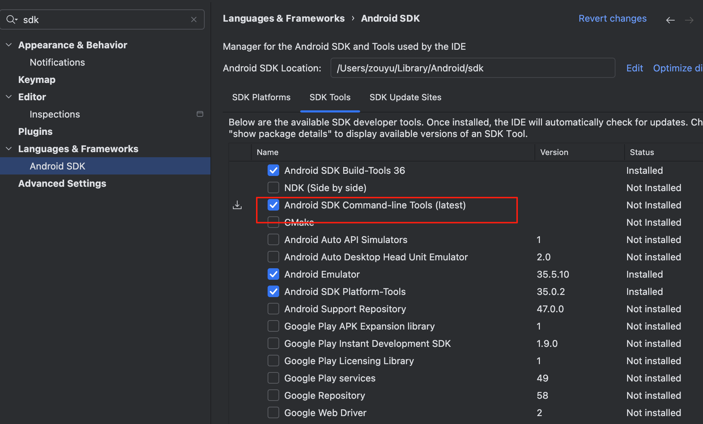

# Flutter 开发环境配置（macOS）

## 一、配置 Flutter SDK

### 1. 下载 Flutter SDK

访问官网：[Flutter SDK 下载 - Stable Channel](https://docs.flutter.dev/install/archive#stable-channel)

下载后解压到指定路径，例如：

```bash
/Users/zouyu/Documents/flutter_sdk/flutter
````

### 2. 配置环境变量

打开终端，编辑 `.zshrc` 文件：

```bash
open ~/.zshrc
```

在文件末尾添加如下内容：

```bash
export PATH=/Users/zouyu/Documents/flutter_sdk/flutter/bin:$PATH
export PUB_HOSTED_URL=https://pub.flutter-io.cn
export FLUTTER_STORAGE_BASE_URL=https://storage.flutter-io.cn
```

保存并执行以下命令使其生效：

```bash
source ~/.zshrc
```

### 3. 检查 Flutter 是否安装成功

```bash
flutter --version
```

### 4. 检查 Flutter 依赖项

```bash
cd /Users/zouyu/Documents/flutter_sdk/flutter
flutter doctor
```

---

## 二、安装 Xcode

### 1. 通过 App Store 安装 Xcode

安装完成后，执行以下命令：

```bash
sudo xcodebuild -license
sudo xcodebuild -runFirstLaunch
```

### 2. 安装 CocoaPods（用于依赖管理）

```bash
brew install cocoapods
pod --version
```

### 3. 检查 iOS 平台是否安装

* 打开 Xcode → Settings → Platforms
* 如果没有安装 iOS Platform，请点击右侧 `Get` 下载

### 4. 打开模拟器

Xcode → Window → Devices and Simulators，查看已安装的模拟器。

---

## 三、真机调试相关说明

### 1. 修改 Bundle ID

每个 Bundle ID 必须唯一，修改默认的 `com.example.demo1`：

```bash
com.example.demo1 → com.zouyu.flutterdemo0211
```

在 Xcode 中修改路径：

* 打开：`ios/Runner.xcworkspace`
* 选择 `Runner` → `Signing & Capabilities`
* 修改 `Bundle Identifier` 字段
* 选择一个 Team（使用你的 Apple ID 即可）

### 2. iOS 14 真机连接 Xcode 不支持的问题

如遇旧设备系统版本（如 iOS 14）Xcode 无法识别，请：

* 访问：[https://github.com/filsv/iOSDeviceSupport](https://github.com/filsv/iOSDeviceSupport)
* 下载对应 iOS 版本的 zip
* 解压后复制到：

```bash
/Applications/Xcode.app/Contents/Developer/Platforms/iPhoneOS.platform/DeviceSupport/
```

### 安卓调试

- 安装 android studio 

- 使用 SDK 管理器



- flutter doctor --android-licenses


---

## 四、创建并启动 Flutter 项目

### 1. 创建项目

```bash
flutter create demo1
cd demo1
// 推荐使用 android studio 可以修改 Organization 应用包名
```

### 2. 修改目录权限（确保无权限问题）

```bash
sudo chown -R $(whoami) .
```

### 3. 获取依赖

```bash
flutter pub get
```

### 4. 查看可用设备

```bash
flutter devices
```

### 5. 启动模拟器（可选）

```bash
open -a Simulator


# 打开模拟器（GUI）
open -a "Android Studio"

# 启动模拟器（命令行）
emulator -avd 模拟器名称
```

### 6. 运行项目

```bash
flutter run

//否则可以指定设备 ID：
flutter run -d emulator-5554
```


**推荐使用  vscode 使用插件 Android iOS Emulator **

Select and run your emulator from Visual Studio Code.

Open all commands with Cmd-Shift-P and type Emulator or click the Emulator icon in the top right.


---

## 五、验证环境配置

```bash
flutter doctor -v
```

---


## 参考资料

* [掘金 Flutter Mac 环境配置教程](https://juejin.cn/post/7478182398409703476)
* [ios真机调试配置参考](https://juejin.cn/post/7112590163884113934)
* [iOS 旧系统支持库](https://github.com/filsv/iOSDeviceSupport)


