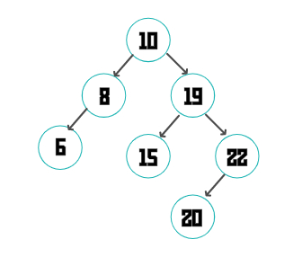
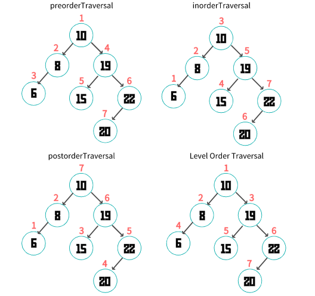

# 树
## 一.树形结构
像数组、栈、队列、默认都是线性结构类型。常见的树形结构有二叉树和多叉树（大于两个叉的树）。

开发中常见的树形结构有: 文件夹目录、DOM结构、路由的配置...... （树的数据结构是非常重要的）

## 常见概念
- 节点 （根节点、父节点、字节点、兄弟节点）

- 子树 （左子树、右子树）,子树的个数称之为度

- 叶子节点 （度为0的节点） 非叶子节点 （度不为0的节点）

- 节点的深度 （从根节点到当前节点所经过的节点总数）

- 节点的高度 （从当前节点到最远叶子节点经过的节点总数）

- 树的层数 （树的高度、树的深度）

- 有序树( 节点按照顺序排列）、无序树

## 二.二叉树
二叉树是每个结点最多有两个子树的树结构 ，每个节点的度最多为2。 通常子树被称作“左子树”（left subtree）和“右子树”（right subtree） ，左子树和右子树是有顺序的

## 二叉树的常见概念
- 真二叉树： 不含一度节点的二叉树称作真二叉树(proper binary tree)
- 满二叉树：满二叉树也是真二叉树，且所有的叶子节点都在最后一层
- 完全二叉树： 深度为k的有n个结点的二叉树，对树中的结点按从上至下、从左到右的顺序进行编号，如果编号为i（1≤i≤n）的结点与满二叉树中编号为i的结点在二叉树中的位置相同，则这棵二叉树称为完全二叉树。
## 三.二叉搜索树
### 1.什么是二叉搜索树？
一般情况下存储数据我们可以采用数组的方式，但是从数组中检索数据的时间复杂度是O(n),如果数据存储有序，则可以采用二分查找的方式来检索数据，复杂度为:O(logn),但是如果操作数组中的数据像增加、删除默认数组会产生塌陷。时间复杂度为O(n)

二叉搜索树中查询、增加、删除复杂度最坏为O(logn)，特性是当它的左子树不空，则左子树上所有结点的值均小于它的根结点的值，当右子树不空，则右子树上所有结点的值均大于它的根结点的值。

也称为：二叉查找树或二叉排序树

### 2.二叉搜索树的主要操作
二叉搜索树中的数据必须具有可比较性

- add 添加元素
- remove 删除元素
- size 元素个数
- contains 包含元素
树是没有索引的，不能通过索引来检索数据

### 3.实现二叉搜索树


```js
class Node {
    constructor(element, parent) {
        this.element = element;
        this.parent = parent;
        this.left = null;
        this.right = null;
    }
}
class BST {
    constructor() {
        this.root = null;
        this.size = 0;
    }
    add(element) {
        if (this.root == null) {
            this.root = new Node(element, null);
            this.size++;
            return;
        }
        let currentNode = this.root; // 默认从根节点开始查找
        let parent = null;
        let compare = null;
        while (currentNode) {
            compare = element - currentNode.element;
            parent = currentNode; // 记住父节点
            if (compare > 0) { // 大于当前节点放到右边
                currentNode = currentNode.right;
            } else if (compare < 0) {
                currentNode = currentNode.left;
            } else {
                currentNode.element = element;
                return;
            }
        }
        let newNode = new Node(element, parent);
        if (compare > 0) {
            parent.right = newNode;
        } else {
            parent.left = newNode;
        }
        this.size++;
    }
}
let bst = new BST();
let arr = [10,8,19,6,15,22];
arr.forEach(item => {
    bst.add(item);
});
console.dir(bst, { depth: 10 });
```
### 4.复杂数据的存储
```js
class Node {
    constructor(element, parent) {
        this.element = element;
        this.parent = parent;
        this.left = null;
        this.right = null;
    }
}
class BST {
    constructor(compare) {
        this.root = null;
        this.size = 0;
        this.compare = compare || this.compare;
    }
    compare(e1,e2){
        return e1 - e2;
    }
    add(element) {
        // ....
        while (currentNode) {
            compare = this.compare(element,currentNode.element);
            // ....
        }
        // ....
        this.size++;
    }
}
let bst = new BST((e1, e2) => {
    return e1.age - e2.age;
});
let arr = [{ age: 10 }, { age: 8 }, { age: 19 }, { age: 6 }, { age: 15 }, { age: 22 }];
arr.forEach(item => {
    bst.add(item);
});
console.dir(bst.root);
```
我们可以自定义比较器传递给二叉搜索树,内部调用比较器进行比较,从而存储数据

## 四.二叉树的遍历
线性数据结构遍历比较简单可以采用正序遍历、逆序遍历

### 1.二叉树的遍历方式
常见的二叉树遍历的四种方式

- 前序遍历Preorder Traversal(先访问根节点、前序遍历左子树、前序遍历右子树)

- 中序遍历 Inorder Traversal(中序遍历左子树、根节点、中序遍历右子树)

- 后续遍历 Postorder Traversal(后序遍历左子树、后续遍历右子树、根节点)

- 层序遍历 Level Order Traversal (从上到下，从左到右依次访问每一个节点)



### 2.前序遍历
```js
preorderTraversal() {
	const traversal = (node) => {
	if (node === null) return
        console.log(node.element); // 先访问根节点
        traversal(node.left); // 在访问左子树
        traversal(node.right);// 在访问右子树
    }
    traversal(this.root);
} 
```
### 3.中序遍历
```js
inorderTraversal() {
    const traversal = (node) => {
        if (node === null) return
        traversal(node.left);
        console.log(node.element);
        traversal(node.right);
    }
    traversal(this.root);
}
```
对于二叉搜索树来说，中序遍历默认从小到大或者从大到小。

### 4.后续遍历
```js
postorderTraversal() {
    const traversal = (node) => {
    if (node === null) return
        traversal(node.left);
        traversal(node.right);
        console.log(node.element);
    }
    traversal(this.root);
}
```
### 5.层序遍历
```js
levelOrderTraversal() {
    if (this.root == null) return;
    let stack = [this.root];
    let currentNode = null;
    let index = 0;
    while (currentNode = stack[index++]) {
        console.log(currentNode.element); 
        if (currentNode.left) {
            stack.push(currentNode.left);
        }
        if (currentNode.right) {
            stack.push(currentNode.right);
        }
    }
}
```
## 五.遍历树对节点进行操作
通过访问器模式获取节点，对节点进行操作处理

```js
preorderTraversal(visitor) {
    if(visitor == null) return;
    const traversal = (node) => {
        if (node === null) return
        visitor.visit(node.element); 
        traversal(node.left); 
        traversal(node.right);
    }
    traversal(this.root);
}
inorderTraversal(visitor) {
    if(visitor == null) return;
    const traversal = (node) => {
        if (node === null) return
        traversal(node.left);
        visitor.visit(node.element);
        traversal(node.right);
    }
    traversal(this.root);
}
postorderTraversal(visitor) {
    if(visitor == null) return;
    const traversal = (node) => {
        if (node === null) return;
        traversal(node.left);
        traversal(node.right);
        visitor.visit(node.element);
    }
    traversal(this.root);
} 
levelOrderTraversal(visitor) {
    if (this.root == null || visitor == null) return;
    let stack = [this.root];
    let currentNode = null;
    let index = 0;
    while (currentNode = stack[index++]) {
        visitor.visit(currentNode.element)
        if (currentNode.left) {
            stack.push(currentNode.left);
        }
        if (currentNode.right) {
            stack.push(currentNode.right);
        }
    }
}
```
通过调用传入的visit方法可以将遍历到的结果传入到visit函数中。用户可以自行处理每次遍历到的结果。

## 六.翻转二叉树
```js
invertTree(){
    if (this.root == null) return;
    let stack = [this.root];
    let currentNode = null;
    let index = 0;
    while (currentNode = stack[index++]) {
        let tmp = currentNode.left;
        currentNode.left = currentNode.right;
        currentNode.right = tmp
        if (currentNode.left) {
            stack.push(currentNode.left);
        }
        if (currentNode.right) {
            stack.push(currentNode.right);
        }
    }
    return this.root;
}
```
翻转二叉树的核心就是树的遍历+左右节点互换而已

## 七.前驱节点 & 后继节点
对一棵二叉树进行中序遍历,遍历后的顺序,当前节点的前一个节点为该节点的前驱节点;

```js
predesessor(node) {
    if (node == null) return null;
    let prev = node.left;
    if (prev !== null) { // 找左子树中最右边的节点
        while (prev.right !== null) {
            prev = prev.right;
        }
        return prev;
    }
    // 当前父节点存在，并且你是父节点的左子树
    while (node.parent != null && node == node.parent.left) {
        node = node.parent;
    }
    return node.parent;
}
```
对一棵二叉树进行中序遍历,遍历后的顺序,当前节点的下一个节点为该节点的后继节点;

```js
successor(node) {
    if (node == null) return null;
    let next = node.right;
    if (next !== null) { // 找左子树中最右边的节点
        while (next.left !== null) {
            next = next.left;
        }
        return next;
    }
    // 当前父节点存在，并且你是父节点的左子树
    while (node.parent != null && node == node.parent.right) {
        node = node.parent;
    }
    return node.parent;
}
```
## 八.删除节点
```js
remove(element) {
    let node = this.node(element);
    if(node == null) return;
    this.size--;
    // 度为2的节点
    if(node.left !== null && node.right !== null){ 
        let pre = this.successor(node);
        node.element = pre.element;
        node = pre;
    }
    // 度为1的节点
    let replace = node.left || node.right;
    if(replace !== null){
        replace.parent = node.parent;
        if(node.parent == null){
            this.root = replace;
        }else if(node == node.parent.left){
            node.parent.left = replace;
        }else{
            node.parent.right = replace;
        }
        // 根节点
    }else if(node.parent == null){
        this.root  = null;
        // 叶子节点
    }else{
        if(node == node.parent.left){
            node.parent.left = null;
        }else{
            node.parent.right = null;
        }
    }
}
```
