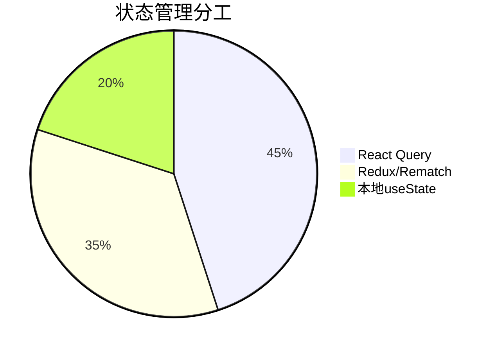

# React 状态管理方案全面对比与选型指南

## 目录
1. [方案概览](#方案概览)
2. [核心维度对比](#核心维度对比)
3. [详细方案分析](#详细方案分析)
   - [Redux](#redux)
   - [Rematch](#rematch)
   - [MobX](#mobx)
   - [Recoil](#recoil)
   - [Hox](#hox)
   - [React Query](#react-query)
4. [选型决策矩阵](#选型决策矩阵)
5. [典型场景推荐](#典型场景推荐)
6. [组合使用策略](#组合使用策略)
7. [迁移成本考量](#迁移成本考量)
8. [未来趋势展望](#未来趋势展望)

## 方案概览

| 方案        | 理念                | 数据流       | 学习曲线 | 包大小   | 维护状态 |
|------------|--------------------|-------------|--------|---------|---------|
| Redux      | 单一不可变存储      | 单向        | 高      | 7KB     | 活跃    |
| Rematch    | 简化版Redux         | 单向        | 中      | 3KB     | 活跃    |
| MobX       | 响应式状态管理      | 双向        | 中      | 16KB    | 活跃    |
| Recoil     | 原子状态管理        | 混合        | 中低    | 14KB    | 实验性  |
| Hox        | 极简模型化状态      | 混合        | 低      | 1KB     | 活跃    |
| React Query| 服务器状态管理      | 单向        | 中      | 12KB    | 活跃    |

## 核心维度对比

### 1. 状态类型支持
- **客户端状态**：Redux、Rematch、MobX、Recoil、Hox
- **服务器状态**：React Query
- **混合状态**：Recoil + React Query

### 2. 数据流模式
| 方案        | 数据流       | 更新方式       | 不可变性   |
|------------|-------------|--------------|----------|
| Redux      | 单向        | 显式dispatch | 强制      |
| Rematch    | 单向        | 方法调用      | 推荐      |
| MobX       | 双向        | 直接修改      | 不要求    |
| Recoil     | 混合        | Setter函数    | 可选      |
| Hox        | 混合        | 直接修改      | 不要求    |
| React Query| 单向        | 自动/手动     | 自动处理  |

### 3. 性能特征
| 方案        | 更新粒度       | 渲染优化      | 内存开销 |
|------------|--------------|-------------|---------|
| Redux      | 中等          | 手动优化      | 低       |
| Rematch    | 中等          | 手动优化      | 低       |
| MobX       | 细粒度        | 自动         | 中       |
| Recoil     | 原子级        | 自动         | 中       |
| Hox        | 组件级        | 中等         | 低       |
| React Query| 查询级        | 自动         | 中       |

### 4. 开发体验
| 方案        | 样板代码量 | TypeScript支持 | 调试工具 | 测试友好度 |
|------------|----------|--------------|---------|----------|
| Redux      | 多       | 优秀          | 优秀     | 高        |
| Rematch    | 少       | 优秀          | 良好     | 高        |
| MobX       | 少       | 优秀          | 优秀     | 中        |
| Recoil     | 中       | 优秀          | 有限     | 中        |
| Hox        | 极少     | 良好          | 有限     | 高        |
| React Query| 少       | 优秀          | 优秀     | 高        |

## 详细方案分析

### Redux

**核心优势**：
- 可预测的状态管理
- 强大的中间件生态（thunk/saga/observable）
- 优秀的时间旅行调试
- 适合大型复杂应用

**痛点**：
- 样板代码过多
- 概念复杂度高（action/reducer/store）
- 需要手动优化性能

**典型代码**：
```javascript
// action
const addTodo = (text) => ({ type: 'ADD_TODO', payload: text });

// reducer
const todos = (state = [], action) => {
  switch (action.type) {
    case 'ADD_TODO':
      return [...state, { text: action.payload }];
    default:
      return state;
  }
};

// store
const store = createStore(todos, applyMiddleware(thunk));
```

**适用场景**：
- 大型企业级应用
- 需要严格状态历史追溯的系统
- 已有Redux技术栈的团队

### Rematch

**核心优势**：
- 保留Redux核心优势
- 减少约80%样板代码
- 内置异步处理
- 兼容现有Redux生态

**痛点**：
- 社区生态小于Redux
- 调试工具支持略弱

**典型代码**：
```javascript
// model
export const todos = {
  state: [],
  reducers: {
    add(state, text) {
      return [...state, { text }];
    },
  },
  effects: (dispatch) => ({
    async addAsync(text) {
      await delay(500);
      dispatch.todos.add(text);
    },
  }),
};

// store
const store = init({ models: { todos } });
```

**适用场景**：
- 想要Redux但嫌复杂的中型应用
- 需要快速开发的项目
- 渐进式迁移Redux的项目

### MobX

**核心优势**：
- 极简代码实现复杂逻辑
- 自动依赖追踪
- 细粒度更新
- 响应式编程范式

**痛点**：
- 过于灵活导致规范难统一
- 黑盒特性导致调试难度
- 兼容性问题（Proxy）

**典型代码**：
```javascript
class TodoStore {
  @observable todos = [];
  
  @action
  addTodo = (text) => {
    this.todos.push({ text });
  };
  
  @computed
  get count() {
    return this.todos.length;
  }
}

const store = new TodoStore();
```

**适用场景**：
- 数据关系复杂的富交互应用
- 需要快速迭代的中小型项目
- 熟悉响应式编程的团队

### Recoil

**核心优势**：
- 原生React式API设计
- 原子级状态管理
- 自动渲染优化
- 并发模式兼容

**痛点**：
- 仍处于实验阶段
- 生态不成熟
- 调试工具有限

**典型代码**：
```javascript
const textState = atom({
  key: 'textState',
  default: '',
});

const charCountState = selector({
  key: 'charCountState',
  get: ({get}) => get(textState).length,
});

function CharacterCount() {
  const count = useRecoilValue(charCountState);
  return <>Character Count: {count}</>;
}
```

**适用场景**：
- 实验性/前沿项目
- 大量局部状态需要共享
- 计划使用React并发模式

### Hox

**核心优势**：
- 极简API设计
- 零学习成本
- 超轻量级
- 完美契合Hooks

**痛点**：
- 功能较为基础
- 缺乏高级特性
- 不适合复杂场景

**典型代码**：
```javascript
// store
const useCounter = () => {
  const [count, setCount] = useState(0);
  const increment = () => setCount(count + 1);
  return { count, increment };
};

export default createModel(useCounter);

// component
const { count, increment } = useModel(counterModel);
```

**适用场景**：
- 小型应用或组件状态共享
- 需要轻量级解决方案
- 快速原型开发

### React Query

**核心优势**：
- 专业的服务器状态管理
- 内置缓存/重试/轮询
- 自动垃圾回收
- 与UI状态解耦

**痛点**：
- 仅处理服务器状态
- 需要配合客户端状态方案

**典型代码**：
```javascript
const { data, isLoading, error } = useQuery(
  'todos',
  () => fetch('/api/todos').then(res => res.json()),
  {
    staleTime: 5000,
    retry: 3
  }
);

const [mutate] = useMutation(
  (newTodo) => axios.post('/api/todos', newTodo),
  {
    onSuccess: () => queryClient.invalidateQueries('todos')
  }
);
```

**适用场景**：
- 数据驱动的应用
- 需要复杂数据同步逻辑
- 频繁与后端交互的系统

## 选型决策矩阵

### 评估维度权重
1. **项目规模** (30%)：小型/中型/大型
2. **团队经验** (20%)：熟悉度/学习成本
3. **状态复杂度** (25%)：简单/中等/复杂
4. **性能需求** (15%)：一般/高要求
5. **未来扩展** (10%)：维护性/生态

### 评分表（1-5分）

| 方案        | 小型项目 | 中型项目 | 大型项目 | 新手团队 | 复杂状态 | 高性能需求 |
|------------|--------|--------|--------|--------|--------|-----------|
| Redux      | 2      | 4      | 5      | 2      | 5      | 4         |
| Rematch    | 3      | 5      | 4      | 4      | 4      | 4         |
| MobX       | 5      | 4      | 3      | 3      | 5      | 5         |
| Recoil     | 4      | 4      | 3      | 4      | 4      | 5         |
| Hox        | 5      | 3      | 2      | 5      | 2      | 3         |
| React Query| 4      | 5      | 5      | 3      | 5*     | 5         |

> *仅针对服务器状态管理

## 典型场景推荐

### 场景1：大型管理后台
- **需求特点**：复杂业务逻辑、严格状态追踪、团队协作
- **推荐方案**：Redux + React Query
- **理由**：
  - Redux提供严格的状态管理
  - React Query处理API状态
  - 完善的调试工具支持
- **替代方案**：Rematch + SWR

### 场景2：数据可视化仪表盘
- **需求特点**：高频状态更新、细粒度渲染
- **推荐方案**：MobX
- **理由**：
  - 自动依赖追踪
  - 最小化渲染开销
  - 响应式编程适合数据流
- **替代方案**：Recoil

### 场景3：中小型ToC应用
- **需求特点**：快速迭代、中等复杂度
- **推荐方案**：Rematch + Hox
- **理由**：
  - Rematch提供核心状态管理
  - Hox处理局部共享状态
  - 平衡开发效率与可维护性
- **替代方案**：MobX

### 场景4：Next.js SSR应用
- **需求特点**：同构渲染、数据预取
- **推荐方案**：Recoil + React Query
- **理由**：
  - Recoil良好支持SSR
  - React Query处理数据预取
  - 原子状态适合组件化架构
- **替代方案**：Redux Toolkit + SWR

## 组合使用策略

### 1. 客户端+服务端状态分离


### 2. 分层架构示例
```javascript
// 顶层配置
const App = () => (
  <QueryClientProvider client={queryClient}>
    <Provider store={store}>
      <RecoilRoot>
        <MainApp />
      </RecoilRoot>
    </Provider>
  </QueryClientProvider>
);

// 状态分工：
// - 用户偏好：Redux
// - API缓存：React Query 
// - 表单状态：Recoil
// - 组件状态：useState
// - 共享UI状态：Hox
```

### 3. 渐进式迁移路径
1. 从纯React开始，使用Context/useState
2. 引入Hox处理跨组件状态
3. 复杂模块采用Rematch
4. API状态迁移到React Query
5. 特殊场景考虑Recoil

## 迁移成本考量

### 从Redux迁移
| 目标方案    | 成本  | 主要工作                     |
|------------|------|----------------------------|
| Rematch    | 低   | 重写reducer为model          |
| MobX       | 中高 | 重构状态更新逻辑             |
| Recoil     | 高   | 完全重写状态逻辑             |

### 从MobX迁移
| 目标方案    | 成本  | 挑战点                       |
|------------|------|----------------------------|
| Redux      | 高   | 不可变数据处理               |
| Recoil     | 中   | 响应式到原子式思维转换       |

### 从Context迁移
| 目标方案    | 成本  | 优势点                     |
|------------|------|--------------------------|
| Hox        | 低   | 几乎无学习成本             |
| Recoil     | 中   | 更好的性能                 |
| Redux      | 中高 | 获得完整工具链             |

## 未来趋势展望

1. **服务器状态专业化**：React Query/SWR将成为标配
2. **原子化状态**：Recoil/Jotai模式可能成为主流
3. **编译时优化**：类似Valtio的proxy方案演进
4. **微前端集成**：状态方案需要更好支持模块化
5. **并发模式适配**：与React 18+深度集成

## 最终建议

1. **新手团队**：从Hox开始，逐步引入Rematch
2. **大型项目**：Redux + React Query黄金组合
3. **交互密集型**：优先考虑MobX
4. **实验性项目**：尝试Recoil新特性
5. **全栈团队**：React Query + 轻量客户端方案

**核心原则**：
- 从简单方案开始，按需演进
- 区分客户端与服务器状态
- 考虑团队熟悉度重于技术新颖性
- 为未来2-3年的扩展留有余地