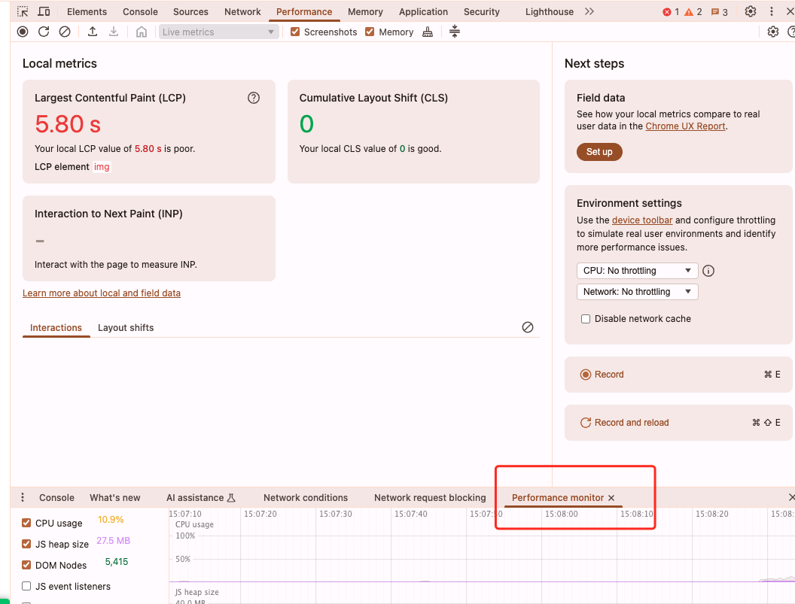

## 开发相关拓展插件
### 1. WEB前端助手（`FeHelper`)
FeHelper简直就是前端开发人员的神器，它是由国人开发的一款前端工具集合的小插件，插件功能齐全，基本上涵盖了前端从业者经常会使用到的**基础功能**，使用起来也很顺手。
下面就来感受一下强大的功能：

FE支持按需安装，也就是说，上面的这些功能， 你需要什用到什么再安装就行， 下面就挑两个我工作中使用到的：

- **json 格式化**

- **页面取色**

- **JS正则表达式验证**
### 2. vue-devtools
vue-devtools是一款基于chrome游览器的插件，用于调试vue应用,被称为“Vue 调试神奇”
vue是数据驱动的, 利用这个插件，这样就能看到vue中每个组件的data、props、computed等多种属性和方法，为我们项目的开发与调试提供了很多的便利 
### 3. React Developer Tools
如果你使用React进行开发，那必不可少的就是`React Developer Tools`, 它是Fecebook出品的，同样使用 `React Developer Tools` 进行调试时，可以查看应用程序的 React 组件分层结构，而不是更加神秘的浏览器 DOM 表示
### 4.接口测试工具
推荐网页版 https://app.apifox.com/main/teams/1430031?tab=project
### 5. ModHeader 修改请求头
ModHeader 是一款强大的浏览器插件，支持 修改 HTTP 请求和响应头，可以帮助开发者调试和测试 API 请求，或者绕过 CORS 限制。它支持 Google Chrome 和 Mozilla Firefox，非常适合用于 API 测试 和 开发环境调试。
在GitHub边侧栏上显示代码树。非常适合查看项目源代码，无需将代码库clone到编辑器就可以如同在编辑器中操作一样， 可以直接搜索文件跳转。
### 6. Lighthouse performance 前端性能优化测试工具

## 日常高频使用（非开发类）

### 1. 上网
https://www.paofu.cloud/user

