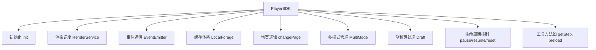

# ✅ **PlayerSDK **


---

# 🧩 **PlayerSDK 的核心使命（一句话）**

**PlayerSDK 是一个课件运行时，它负责：加载页面、切页、管理状态、调度渲染、控制多模式、处理缓存、事件派发。**

也就是说：

> **PlayerSDK = 状态机 + 渲染调度器 + 多端通信层 + 缓存层**

它是整个互动课堂课件运行的 **核心 orchestrator（调度器）**。

---

# 🌈 用一张图先理解结构



---

# 🔥 **逐段解释代码在干什么（并解释为什么这么做）**

---

# 1. ❄ Polyfill + 缓存系统初始化

```ts
import localforage from 'localforage'
...
const base64Store = ...
const textBase64Store = ...
const pagesStore = ...
```

### ✔ 做什么？

为浏览器端构建 **多存储层次缓存系统**：

* 页面 JSON 缓存
* 文本图片缓存
* 缩略图缓存

全部通过 localforage 包装：

* 优先使用 **IndexedDB**
* 失败 fallback 到 WEBSQL
* 再 fallback 到 localStorage

### ✔ 为什么？

因为：

* 页面数据大（几百 KB）
* 文本渲染图（base64）更大（几 MB）
* 缓存能显著减少加载时间（尤其是预览 / 多页切换 / 低网速）

---

# 2. ⚡ PlayerSDK 的构造函数：绑定 slides + renderService

```ts
constructor(slides, renderConfig) {
  this.slides = slides;
  this.renderService = new RenderService(renderConfig)
}
```

### ✔ 做什么？

* 初始化课程的所有页面（slides）
* 初始化渲染系统（RenderService）

### ✔ 为什么？

RenderService 是控制 **iframe / webview / canvas** 的统一抽象：

> PlayerSDK 不关心真实渲染方式
> RenderService 让 “渲染端” 可替换（Cocos、H5、小游戏等）

这就是 **抽象层解耦**。

---

# 3. 🌟 init：SDK 的启动入口

```ts
async init(traceID) {
  initPolyfill();
  if preview -> initDraft()
  const renderClients = await renderService.init()
  addRenderEvent(...)
}
```

### ✔ 做什么？

1. 加载 polyfill（兼容不同运行环境）
2. 处理 preview 模式的草稿逻辑
3. 初始化渲染客户端（可能是多个：SE、Cocos、Widgets）
4. 注册渲染端事件

### ✔ 为什么？

SDK 必须为 *老师端、学生端、预览器、编辑器、小程序* 等多端统一逻辑。

---

# 4. 🔁 切页逻辑（核心功能）

核心方法：

```ts
changePage()
multiModeChangePage()
draftDataChangePage()
```

## 它解决的问题：

### ✔ 问题 1：如何切到下一页？

* 切换 render type（widgets/cocos/slide）
* 通知渲染端渲染内容
* 更新 currentPage

### ✔ 问题 2：如何处理多人模式（multiMode）？

不同 user 同时切页：

```ts
this.multiModeData[uid] 保存每个玩家所在页面 uuid
```

### ✔ 问题 3：preview 模式没有接口，如何本地渲染？

用草稿缓存：

```ts
draftDataChangePage()
getDraftData()
combineTextImg()
```

### ✔ 问题 4：弱设备如何优化？

低设备（lowDevice）下不完全刷新渲染器，减少性能消耗。

---

# 5. 🌀 状态管理相关

```ts
changeState()
getStep()
nextStep()
prevStep()
reset()
pause()
resume()
```

### ✔ 做什么？

统一将状态操作派发给渲染端：

```ts
renderClient.call('xxx')
```

### ✔ 为什么？

渲染端不一定是同一种引擎：

* React widgets
* Canvas 渲染器
* WebGL（Cocos）
* 小程序渲染

统一封装 → SDK 就是跨引擎协议层。

---

# 6. 🔌 渲染端事件监听（桥接层）

```ts
addRenderEvent(render)
```

渲染端触发事件，如：

* change
* changeStep
* tracker
* goToSlide
* videoError
* submitMoment
* submitSpeakingTest

SDK 做桥接：

```ts
render.on('xxx', emitter.emit.bind(...))
```

### ✔ 为什么？

**SDK 是宿主端 ↔ 渲染端的中间层**

统一事件协议避免：

* teacher、student、preview 互相不兼容
* 渲染端实现差异（SE/cocos/widgets）导致重复逻辑

---

# 7. 🗃 catalog（获取目录 + 缩略图）

```ts
catalog() => 返回slides + thumbnailUrl
```

预览页需要缩略图，所以需要：

* 从 base64Cache 中取缩略图
* 绑定到 slide 对象

---

# 🧠 **整体设计理念总结**

### ✔ 1. 使用 “调度器” 模式

PlayerSDK = 中央大脑
RenderService = 渲染后端
滑动、播放、步骤、状态 → 都靠调度器统一管理

### ✔ 2. 多引擎抽象（Engine Abstraction）

支持：

* widgets 引擎（H5）
* cocos 引擎（游戏）
* slide（轻渲染器）

PlayerSDK 通过 `renderClient.call()` 隐藏差异。

### ✔ 3. 多端兼容（host agnostic）

同一套代码能跑在：

* 老师端
* 学生端
* 预览器
* 编辑器
* 小程序
* webview

### ✔ 4. 缓存优先设计

课程数据大，网络慢的环境很多（学校网络）。

### ✔ 5. 事件驱动设计

渲染端通过 emitter 发回事件，SDK → 宿主再派发。

### ✔ 6. 强大的切页状态机

切页是课件运行的核心，必须支持：

* 在多种模式下无缝切换
* 异步加载
* 回滚
* 错误处理
* 弱设备降级

---

# 🎯 最终一句话总结

> **PlayerSDK 是一个对外统一接口，对内统一调度的课件运行时，它将缓存、渲染、状态、多端通信抽象为一套可扩展框架。**

---


